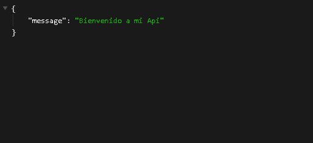

# Tarea-5-API-REST
## Despiegue de la página

Para deplegar la página use railway.app aqui esta el link para acceder a la misma.

Link : [APIREST](https://tarea-5-api-rest-production.up.railway.app/ "Tarea-5")

## Tests para probar la Api
### Ruta principal
 GET https://tarea-5-api-rest-production.up.railway.app/

### Ruta ping
 GET https://tarea-5-api-rest-production.up.railway.app/ping

### Ruta para obtener lista de todos los lenguajes
 GET https://tarea-5-api-rest-production.up.railway.app/api/lenguajes

### Ruta para obtener un lenguaje
Añadir algun valor existente en la lista /1, /2, /3 , etc....

GET https://tarea-5-api-rest-production.up.railway.app/lenguajes/1

### Crear un nuevo lenguaje
 POST https://tarea-5-api-rest-production.up.railway.app/api/lenguajes Content-Type: application/json 
 
{
  "name" : "C",
  "year" : 1997
}

### Actualizar algun lenguaje
 PATCH https://tarea-5-api-rest-production.up.railway.app/api/lenguajes/7 Content-Type: application/json 
 
{
  "name" : "nuevo lenguaje",
  "year" : 2008
}

### Ruta para borrar algun lenguaje
DELETE https://tarea-5-api-rest-production.up.railway.app/api/lenguajes/3
